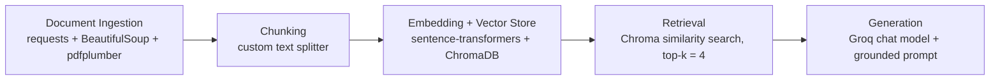

# Project 1 Planning: The Unofficial Guide

> Write this document before you write any pipeline code.
> Your spec and architecture diagram are what you'll use to direct AI tools (Claude, Copilot, etc.) to generate your implementation — the more specific they are, the more useful the generated code will be.
> Update the Retrieval Approach and Chunking Strategy sections if you change your approach during implementation.
> Update this file before starting any stretch features.

---

## Domain

Study abroad resources for HBCU students and Black travelers, with a focus on funding, destination selection, safety, and the lived experience of traveling while Black.

This knowledge is valuable because the best guidance is split across university pages, scholarship sites, academic research, and personal travel stories. A lot of official study abroad material is written for a generic student audience and does not address concerns that matter to HBCU students, such as affordability, hair and skin care, racism abroad, and finding Black-friendly support systems.

---

## Documents

| # | Source | Description | URL or location |
|---|--------|-------------|-----------------|
| 1 | HBCU Lifestyle: Study Abroad Resources | Article | https://hbculifestyle.com/study-abroad-hbcu-resources/ |
| 2 | Gilman International Scholarship Program | Official Program | https://www.gilmanscholarship.org/ |
| 3 | "If Not Us Then Who?" - Megan Covington | Academic Paper | https://independent.academia.edu/MeganCovington |
| 4 | The HBCU Career Center: Study Abroad | Career Resource | https://www.thehbcucareercenter.com/college-student-career-planning/study-abroad/ |
| 5 | Green Book Global: Ultimate Guide to Black Travel | Guide / Tool | https://greenbookglobal.com/travel-the-world/ultimate-guide-to-black-travel/ |
| 6 | Melanin Base Camp: Hair & Skin Care Abroad | Blog / Personal | https://www.melaninbasecamp.com/trip-reports/2024/10/20/traveling-while-black-how-i-care-for-my-hair-and-skin-while-abroad |
| 7 | Joy Worldwide: Best Study Abroad Destinations for HBCU Students | Article | https://www.joyworldwideinc.com/blog/the-best-study-abroad-destinations-for-hbcu-students |
| 8 | Northwestern: Black History Month Global Week | University Resource | https://www.northwestern.edu/abroad/events/black-history-month |
| 9 | USC Dissertation: Black Students and Career Readiness Abroad (2023) | Dissertation | https://scholarcommons.sc.edu/etd/7274 |
| 10 | TikTok: #GilmanScholarship + #HBCU Study Abroad | Social / Short Video | https://www.tiktok.com/discover/gilman-scholarship-essay-tips |

---

## Chunking Strategy

**Chunk size:** 1000 characters

**Overlap:** 150 characters

**Reasoning:** Most of the corpus is made up of short articles, list-heavy guides, and resource pages with clear headings. A 1000-character chunk usually keeps one topic together without swallowing unrelated navigation text, while 150 characters of overlap helps preserve context when a scholarship detail, safety tip, or destination recommendation crosses a boundary. Before chunking, I will strip nav/footer boilerplate, normalize whitespace, and keep headings and bullet lists intact when possible.

---

## Retrieval Approach

**Embedding model:** sentence-transformers/all-MiniLM-L6-v2

**Top-k:** 4

**Production tradeoff reflection:** If cost were not a constraint, I would use a larger embedding model with stronger semantic recall and better handling of long-form and domain-specific language, then add a reranker on top. That would likely improve matches for academic writing, travel-safety language, and Black travel experience terms, but it would also increase latency, memory use, and operational complexity compared with a lightweight local model.

---

## Evaluation Plan

| # | Question | Expected answer | Actual Response | Accuracy Judgement |
|---|----------|-----------------|---------------|------------------|
| 1 | According to the Gilman program website, what is the full program name and which U.S. government office funds it? | Benjamin A. Gilman International Scholarship Program; funded by the U.S. Department of State's Bureau of Educational and Cultural Affairs. | The full program name is the Benjamin A. [1] Gilman International Scholarship Program [3], and it is funded by the U.S. Government, with the U.S. [3] Department of State's Bureau of Educational and Cultural Affairs being the specific office involved [1] [3] [5].| Accurate|
| 2 | Which specific HBCUs are explicitly listed on the HBCU Lifestyle page as having established international exchange programs? (List the institutions named.) | Howard University; Morehouse College; Spelman College. |The specific HBCUs explicitly listed as having established international exchange programs are Howard University, Morehouse College, and Spelman College [2].| Accurate |
| 3 | List two concrete safety recommendations given by The HBCU Career Center's "Stay Safe Abroad" guidance. (Provide the exact practices.) | Examples: "Be alert"; "Make and secure copies of your important papers." | Two concrete safety recommendations given by The HBCU Career Center's "Stay Safe Abroad" guidance are: Be alert [1] [2] and Establish a routine for communicating with family and stick to it [1] [2].| Accurate |
| 4 | What filtering criteria does Green Book Global's destination tool provide? (Name at least two criteria used by the tool.) | Examples: "travelingWhileBlackScore"/threat-of-racism metric and filters for affordability, adventure, romance, and local-food scores. | Green Book Global's destination tool provides filtering criteria such as the threat of racism, Romance, Affordability, and Adventure [3]. This allows travelers to find destinations that have a low threat of racism and also meet their other preferences. [2] | Accurate |
| 5 | According to the Melanin Base Camp article, name two recommended hair or skin care strategies travelers should prepare before departure. | Examples: protective styles (e.g., knotless braids) and packing moisturizers/oils and non-whitening sunscreen. |According to the Melanin Base Camp article, two recommended hair or skin care strategies travelers should prepare before departure are packing the right hair care products, such as moisturizers, oils, and leave-in conditioners [2], and planning for water with high levels of mineral content by pre-planning [2].| Accurate |

---

## Anticipated Challenges

1. Some sources are long, promotional, or navigation-heavy, so retrieval can surface boilerplate or related links instead of the actual guidance the user needs.

2. Important details are often split across headings, bullet lists, or narrative sections, which means too-small chunks or too-low top-k could miss the exact scholarship, safety, or destination answer.

---

## Architecture

---

## AI Tool Plan

**Milestone 3 - Ingestion and chunking:** I will use Copilot with the Domain, Documents, and Chunking Strategy sections from this plan plus the requirements file. I expect it to produce the document loader, HTML/text cleaning, and chunking code. I will verify that it removes boilerplate, keeps source metadata, and produces chunks near the target size without splitting obvious headings mid-thought.

**Milestone 4 - Embedding and retrieval:** I will use Copilot or Claude with the Retrieval Approach section and the evaluation questions. I expect it to wire up sentence-transformers and ChromaDB, persist embeddings, and return the best matching chunks for a query. I will verify retrieval by running the five test questions and checking that the top chunks actually support the answer.

**Milestone 5 - Generation and interface:** I will use Copilot with the Architecture, Retrieval Approach, and document source list to build the Groq-backed answer generation and the query interface. I expect it to produce a response layer that cites sources, stays within retrieved evidence, and a simple UI for asking questions. I will verify that the system refuses or hedges when retrieval does not support an answer and that the cited sources match the retrieved chunks.

